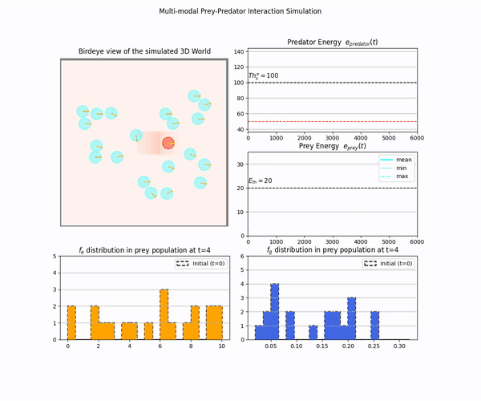
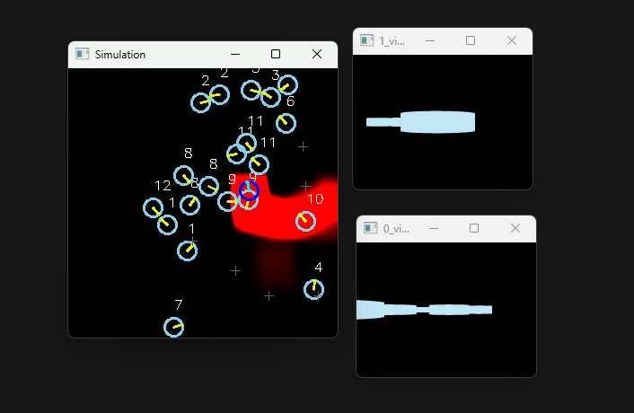

## Multimodal and evolutionary prey-predator interaction simulation

For publication in `Biomimetics`:

[Sun, X.; Hu, C.; Liu, T.; Yue, S.; Peng, J.; Fu, Q. Translating Virtual Prey-Predator Interaction to Real-World Robotic Environments: Enabling Multimodal Sensing and Evolutionary Dynamics. Biomimetics 2023, 8, 580. https://doi.org/10.3390/biomimetics8080580](https://www.mdpi.com/2313-7673/8/8/580/htm#)

1. Dependencies
+ python 3.6+
+ pyrender
+ cv2
+ trimesh

2. How to use

run `simulation.py`, you will see the following pop-up windows visulizing the simulation. 

The cyan circles represent the prey agents while the red circle is the predator who is able to hunting in the bounded arena and release 'killing' pheromone. Yellow bars indicate the agent's current heading directions.

The two smaller windows show the real-time view of two selceted preys. Cross markers depict the there was a prey dead here.

From the simulation, you could see that the prey's behaviors of `gathering together` in which they can obtain energy and `escaping from the predator's odor field` in which they will lose energy.
